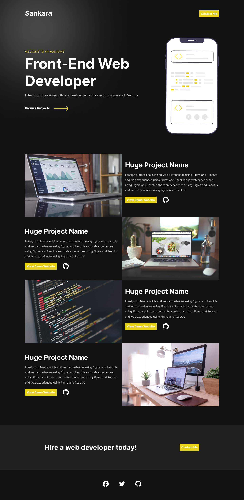

# About the repository

This repository contains 11 front-end HTML, CSS and JavaScript projects which include the design files, outlined as follows (in the order in which we will build them):

1. Profile Card Component 
2. Sign Up Form 
3. Modal 
4. Accordion 
5. Restaurant Website 
6. Portfolio Website 
7. Image Gallery 
8. Admin Dashboard 
9. Fullscreen Background 
10. Google Homepage Clone - https://google.com
11. Techie Website 

## Challenges

1. Try to make a menu popup when you click **Today's Menu** Button on the Restaurant Website Project - Project 5
2. I did not build the mobile version of the Admin Dashboard. Can you make one? I'd love to see it. Tag me on Twitter [@TSBSankara](https://twitter.com/TSBSankara) - Project 8
3. Make a functional mobile menu navbar on the Healthcare Website on Project 9

## Conclusion

1. Enjoy learning and building the projects :)
2. Follow me @tsbsankara on Twitter and @SankThomas on GitHub.
3. Visit (and share) my Gumroad Profile for more designs I have made. Click [here](https://tsbsankara.gumroad.com).
